# User Guide

&nbsp;

Below you will find all the illustrated steps to perform a correct installation.

&nbsp;

## Prepare the Raspberry Pi 5

Download the software **Raspberry Pi Imager** which you will use to configure and write to the drive you will mount on your Raspberry Pi 5 the host operating system. The software can be used from Windows, MacOS and Ubuntu. You can download it [here](https://www.raspberrypi.com/software/).

After installing and opening it you will see the following screen.

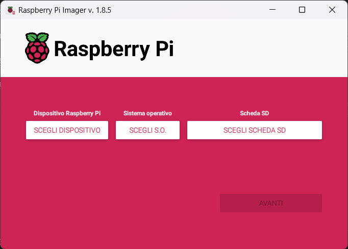

In 'CHOOSE DEVICE' you have to select 'Raspberry Pi 5'

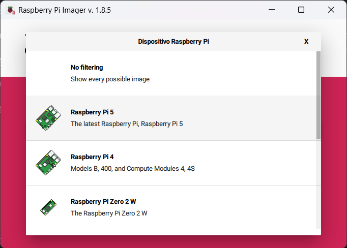

In 'CHOOSE OS' you have to select 'Other general-purpose OS', then select 'Ubuntu', then an Ubuntu Server LTS edition.

!!! tip

    I decided to use Ubuntu Server as it is a very lightweight operating system and does not interfere with running Windows.

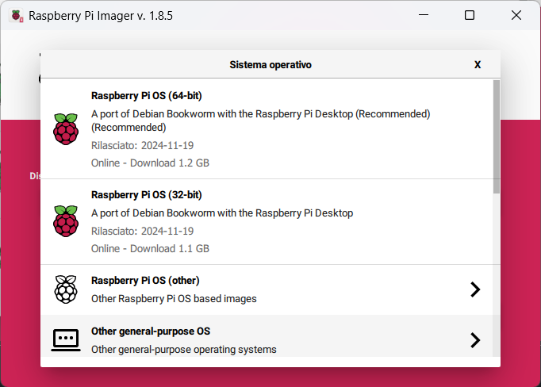

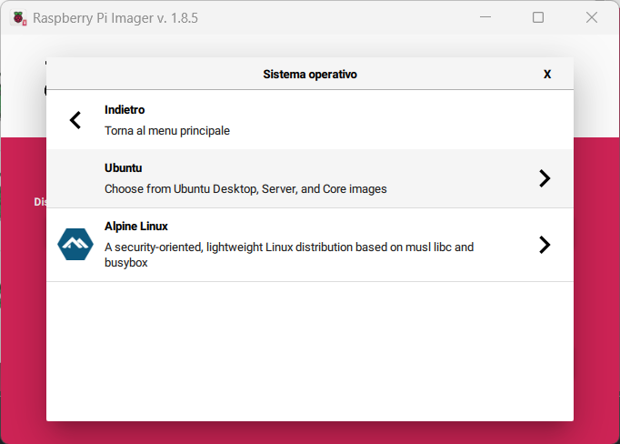

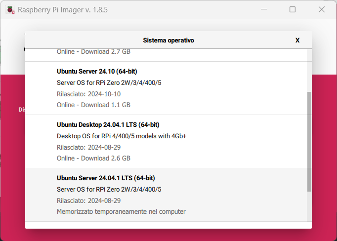

Finally, in 'CHOOSE STORAGE' you have to select the drive that you will use in your Raspberry Pi 5.

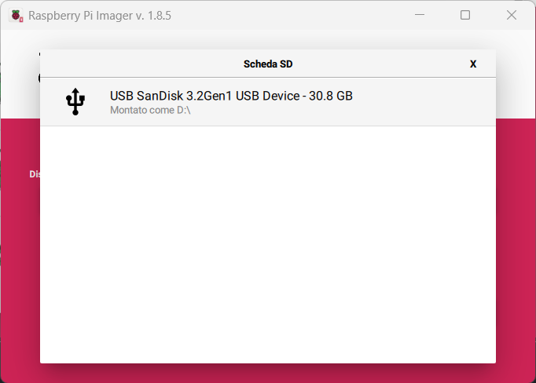

The 'NEXT' button will then unlock and once clicked you will be able to customize your installation. Just click 'EDIT SETTINGS' and set appropiate settings.

In the 'GENERAL' tab flag the option 'Set username and password'. You need it to authenticate through SSH later. Then if you wanna use the WiFi, flag the option 'Configure WiFi'. In the 'SERVICES' tab flag the option 'Enable SSH'. Finally click 'SAVE'.

!!! warning

    Avoid to use the WiFi. Sometimes **WiFi 5GHz** and **WPA3-Personal** as authentication may not work properly. Use the Ethernet connection instead.

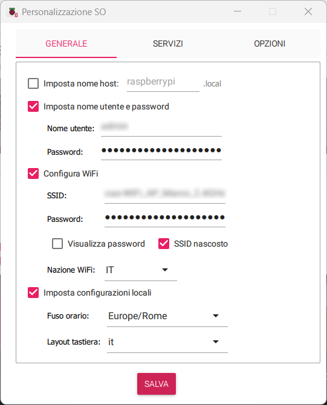

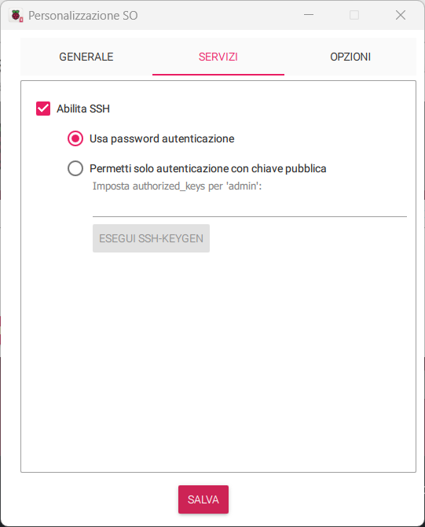

Now, you are ready! Just click 'Yes' to apply your settings and the host OS will be installed in your Raspberry Pi 5. It usually takes a few minutes and depends mostly on the speed of your Internet connection.

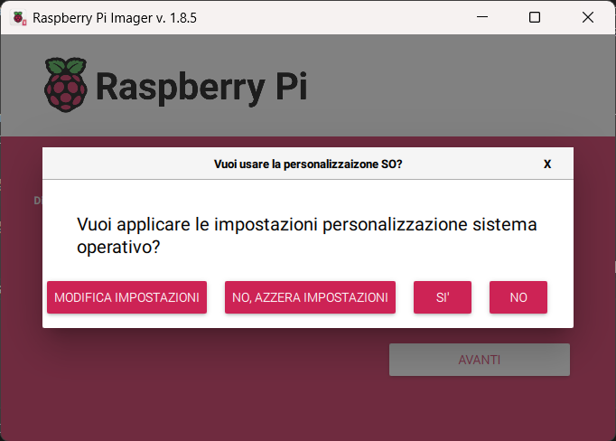

&nbsp;

## First boot

Plug the drive into your Raspberry Pi 5 then power it up and wait a few minutes for it to be ready to SSH into.

Before proceeding you will need to locate the local IP address where your Raspberry Pi 5 is connected. To do this, access the configuration page of your router and check which is the correct IP.

Once you have found the IP address, connect to your Raspberry Pi 5 with an SSH client. For example, on Windows you can use the `ssh` command to connect with the Terminal or you can use [PuTTY](https://www.putty.org/). Enter the credentials you configured earlier and connect.

Before you begin you will need to update your host operating system. Since we are using Ubuntu you will need to run these commands.

``` bash
sudo apt update && sudo apt upgrade -y
```

Install Raspberry Pi kernel drivers with this command (optional).

``` bash
sudo apt install linux-raspi -y
```

&nbsp;

## Install QEMU and dependencies

Now you are ready to start installing all the dependencies needed to run the VM with Windows 11. We then install **QEMU** with the following command.

``` bash
sudo apt install qemu-system-arm qemu-utils -y
```

Install **PipeWire**, a media server used in many modern Linux systems to handle audio and video.

``` bash
sudo apt install pipewire pipewire-audio-client-libraries -y
```

&nbsp;

## Configure the TPM

Windows 11 except the IoT version, requires the TPM to run so we need to configure it.

Install **swtpm**, a package to emulate the TPM.

``` bash
sudo apt install swtpm -y
```

Create a folder to save TPM things in.

``` bash
mkdir -p /tmp/win11tpm
```

Create a service. This will make it start automatically every time you reboot your Rasperry Pi 5.

``` bash
sudo nano /etc/systemd/system/swtpm.service
```

Paste this content into and save.

```
[Unit]
Description=swtpm service
After=network.target

[Service]
ExecStart=/usr/bin/swtpm socket --tpm2 --tpmstate dir=/tmp/win11tpm --ctrl type=unixio,path=/tmp/win11tpm/swtpm-sock
Restart=always
User=root
Group=root

[Install]
WantedBy=multi-user.target
```

Reload the services of `systemd`.

``` bash
sudo systemctl daemon-reload
```

Enable and start the service.

``` bash
sudo systemctl enable --now swtpm.service
```

Check if everything it's ok.

``` bash
sudo systemctl status swtpm.service
```

&nbsp;

## Configure the VM

To make the VM creation process easier, let's create a new folder that contains everything essential to start the VM. We call the new folder `qemu`.

``` bash
mkdir qemu && cd qemu
```

Now let's create the image file that contains Windows when we use the VM. Windows 11 requires **64 GB or more space** to run.
In this case I will create a drive with 128 GB of space. You can increase or decrease the space if you want.

``` bash
qemu-img create win11-arm64.img 128G
```

The file name of the drive it's `win11-arm64.img`. You can choose another name if you want.

Now you need the UEFI firmware to run Windows 11 correctly. You can download required files with sending these commands.

``` bash
wget https://raw.githubusercontent.com/Marko97IT/rpi5-qemu-win11.github.io/refs/heads/main/assets/uefi/QEMU_EFI-pflash.raw
```

``` bash
wget https://raw.githubusercontent.com/Marko97IT/rpi5-qemu-win11.github.io/refs/heads/main/assets/uefi/QEMU_VARS-pflash.raw
```

Download VirtIO drivers with this command.

``` bash
wget https://raw.githubusercontent.com/Marko97IT/rpi5-qemu-win11.github.io/refs/heads/main/assets/drivers/virtio-win-0.1.266.iso
```

Also, you need to download the ISO of Windows 11 ARM64. You can use the command `wget` to download it from the Raspberry Pi 5.
An example of command can be this.

!!! tip
    Consider the **Windows 11 IoT Enterprise** edition. It is specifically built for IoT devices.

``` bash
wget https://site.com/urlwin11.iso
```

Now, you can start the VM and install Windows 11. Run this command. If you have a little bit of skill you can tweak the command to customize your VM.

!!! warning
    The command sets 7 GB of RAM because I have 8 GB of RAM. If you have a Raspberry Pi 5 with less RAM, change the `-m 7G` value to a different amount.
    Leave a minimum amount of RAM for the host OS or you may experience instability. 1 GB of memory should be sufficient.

!!! info
    Change the value `win11.iso` with the name of your ISO.

``` bash
sudo qemu-system-aarch64 \
  -M virt \
  -m 7G \
  -cpu max \
  -smp 4,cores=2,threads=2 \
  --accel kvm \
  -drive if=pflash,file=./QEMU_EFI-pflash.raw,format=raw \
  -drive if=pflash,file=./QEMU_VARS-pflash.raw,format=raw \
  -device ramfb \
  -device qemu-xhci \
  -device usb-ehci \
  -device usb-kbd \
  -device usb-tablet \
  -device virtio-gpu \
  -device usb-storage,drive=install \
  -drive if=none,id=install,format=raw,media=cdrom,file=./win11.iso \
  -device usb-storage,drive=virtio-drivers \
  -drive if=none,id=virtio-drivers,format=raw,media=cdrom,file=./virtio-win-0.1.266.iso \
  -chardev socket,id=chrtpm,path=/tmp/win11tpm/swtpm-sock \
  -tpmdev emulator,id=tpm0,chardev=chrtpm \
  -device tpm-tis-device,tpmdev=tpm0 \
  -nic user,model=virtio-net-pci \
  -drive if=virtio,id=system,format=raw,file=./win11-arm64.img \
  -vnc :0
```

&nbsp;

## Install Windows 11

Since Windows setup requires you to press any key to start the installation, before running the command to start the VM, install a **VNC client** and have it ready to connect. The IP address for the VNC connection will be the same as the one you use to connect with SSH to your Raspberry Pi 5.
Once you run the command to start the VM quickly connect to VNC to start the installation when prompted.

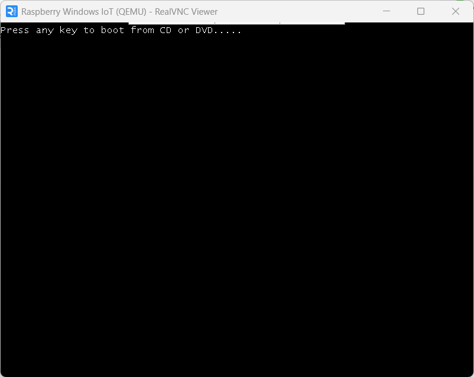

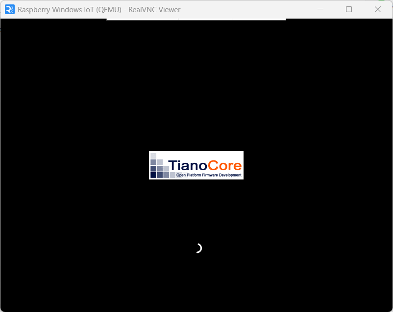

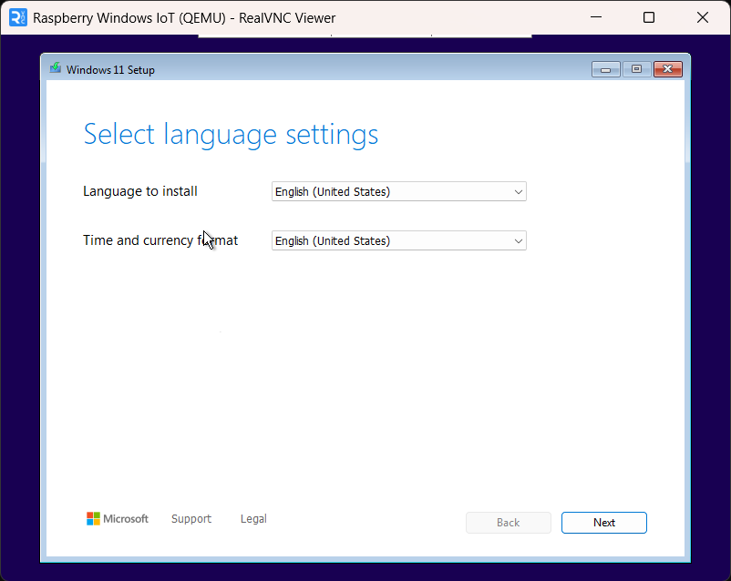

Most likely your Windows installation does not have the drivers needed to view the disks. You will need to install the drivers to continue. Click 'Load Driver' then press 'Browse'.

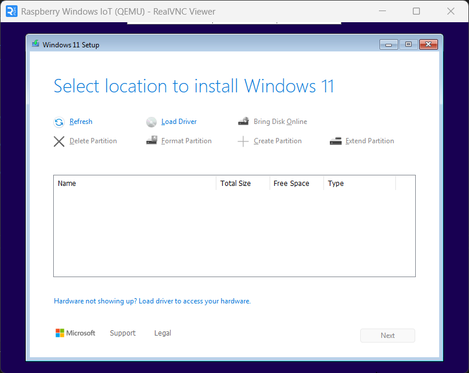

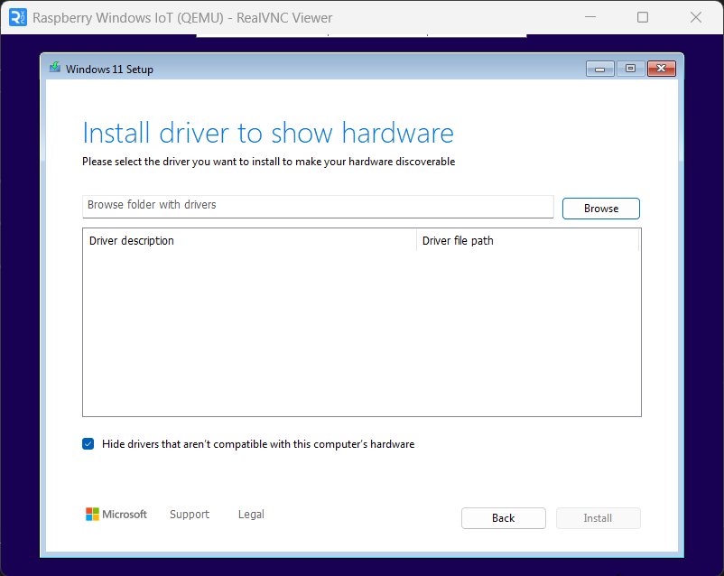

Navigate to `E:\viostor\w11\ARM64` and continue. May be the drive letter isn't `E:`, so you have to select the drive named `virtio-win...`.

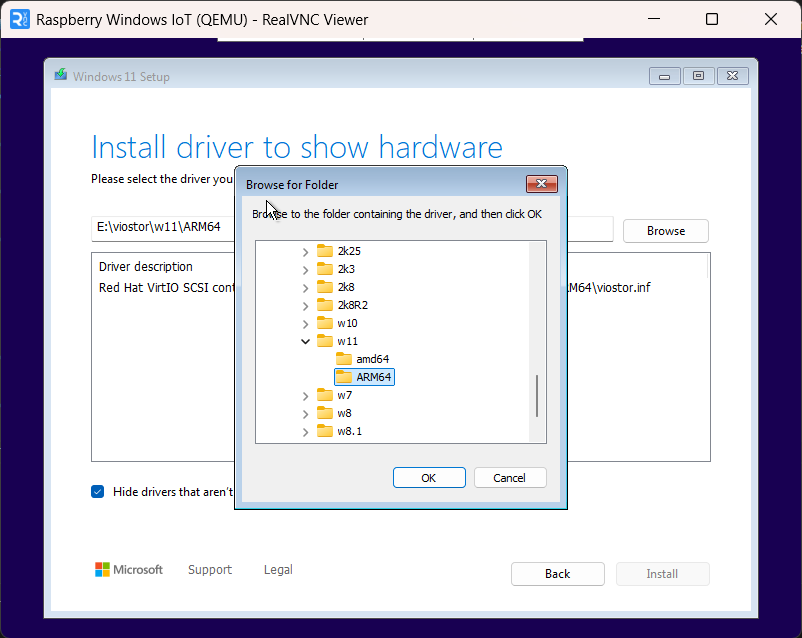

Select `Red Hat VirtIO SCSI controller` and press 'Install'.

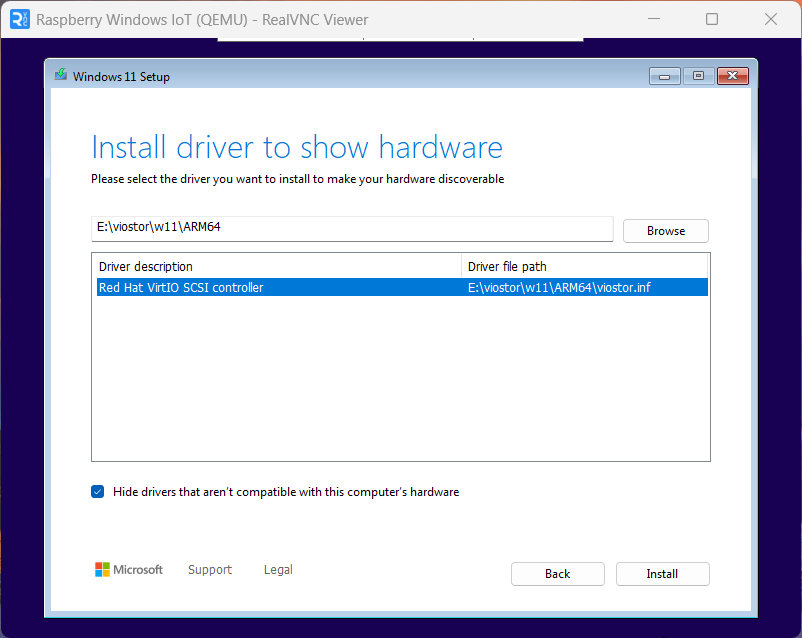

Now you can install Windows in Disk 0.

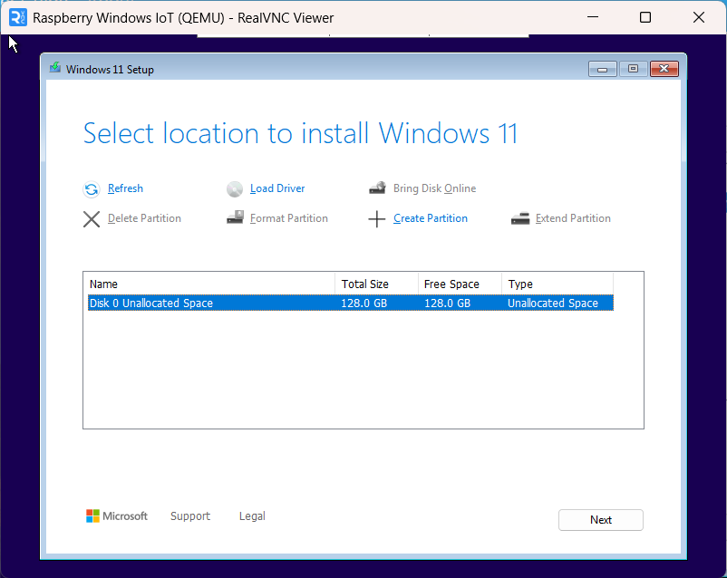

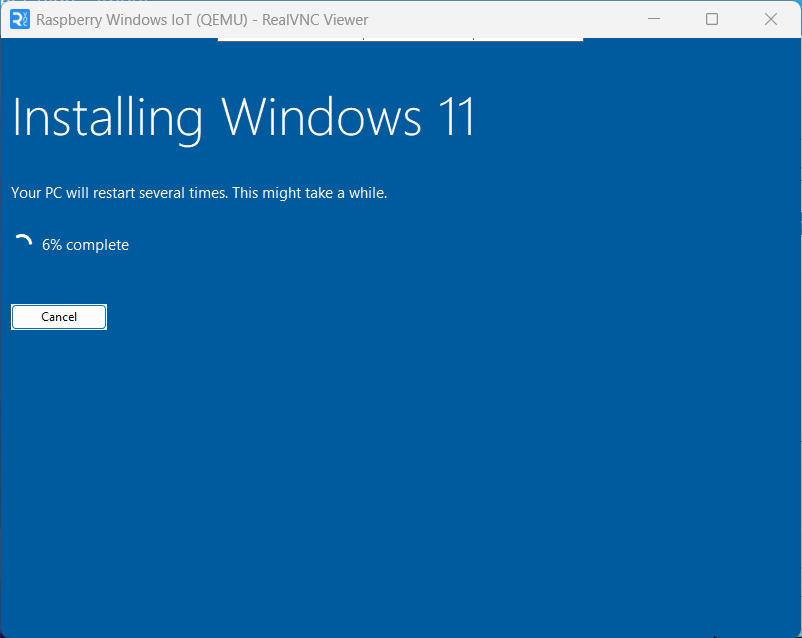

Now complete OOBE setting of Windows without the Internet connection.

!!! info
    If you want to connect to the VM with RDP, you will need to set a password for the user.

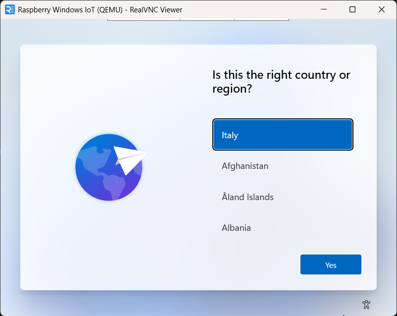

When you're in the Desktop, go to Start and search 'Device Manager' and open it.

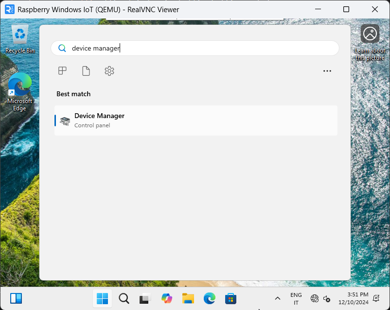

Click the 'Add driver' button and navigate to the CD-ROM drive of VirIO drivers, then press 'Next'. Leave the flag 'Include subfolders' enabled.

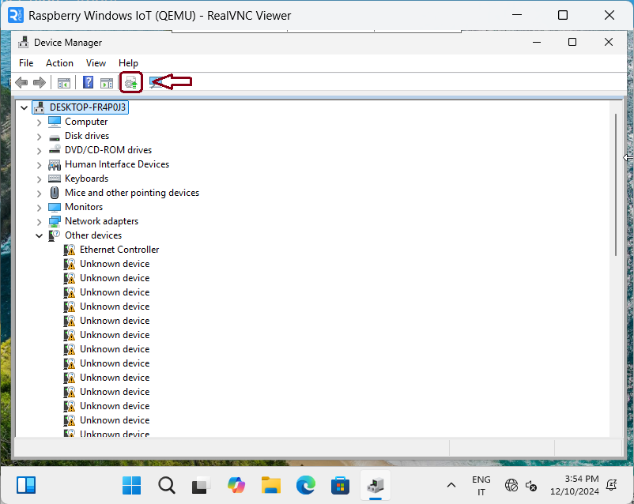

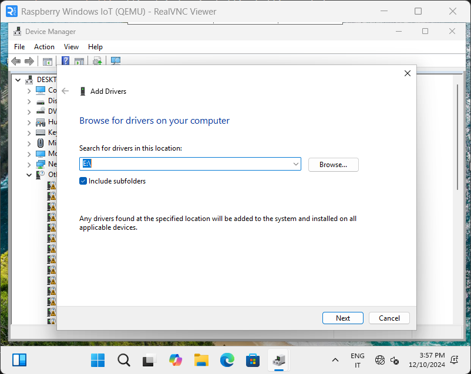

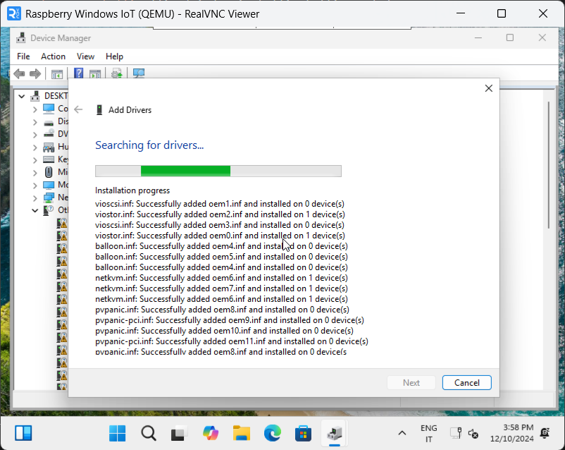

When the installation is finished, **don't reboot Windows**, just close the window.

Go to Start and search 'Remote desktop settings' and open it.

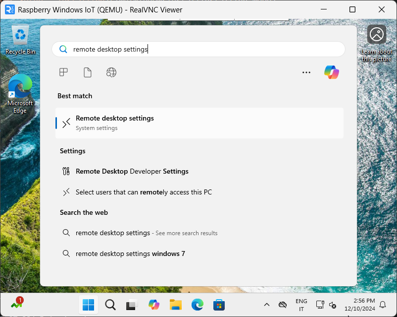

Flag 'Remote Desktop' and press 'Confirm'. Now you can connect to the VM with RDP.

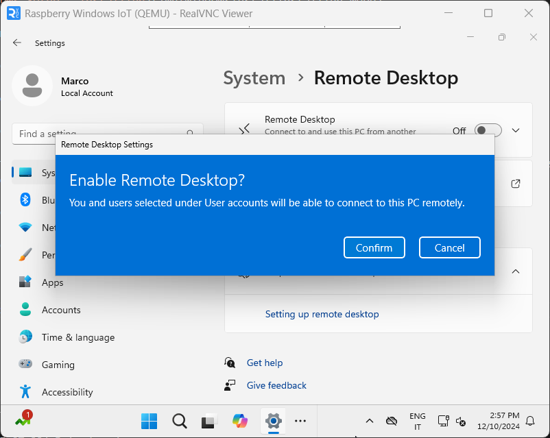

Finally, shutdown Windows and stop the VM by pressing CTRL + C in the SSH console.

&nbsp;

## Use Screen

To keep the VM alive and be able to exit the SSH console we use a very powerful tool called `screen`.

Run this command to create a new screen.

``` bash
screen -S VM
```

Run the command to run the VM. This time the command is little different since we don't need the VirtIO driver drive and the Windows installation drive.

``` bash
sudo qemu-system-aarch64 \
  -M virt \
  -m 7G \
  -cpu max \
  -smp 4,cores=2,threads=2 \
  --accel kvm \
  -drive if=pflash,file=./QEMU_EFI-pflash.raw,format=raw \
  -drive if=pflash,file=./QEMU_VARS-pflash.raw,format=raw \
  -device qemu-xhci \
  -device usb-ehci \
  -device usb-kbd \
  -device usb-tablet \
  -device virtio-gpu \
  -chardev socket,id=chrtpm,path=/tmp/win11tpm/swtpm-sock \
  -tpmdev emulator,id=tpm0,chardev=chrtpm \
  -device tpm-tis-device,tpmdev=tpm0 \
  -nic user,model=virtio-net-pci,hostfwd=tcp::3389-:3389 \
  -drive if=virtio,id=system,format=raw,file=./win11-arm64.img \
  -vnc :0
```

Then, you can exit the screen session pressing CTRL + A + D. You can see the screen sessions sending this command.

``` bash
screen -ls
```

If the screen is enabled you'll see an output like it and VM will still up.

```
There is a screen on:
        8188.VM (12/10/24 08:15:42)     (Detached)
1 Socket in /run/screen/S-admin.
```

To resume the screen just run this command.

``` bash
screen -r VM
```

&nbsp;

## Enjoy Windows 11

The guide is now complete. Simply boot the VM with screen and you will have a fully functional Windows 11 VM.

You can connect with VNC or RDP using the host's IP address.

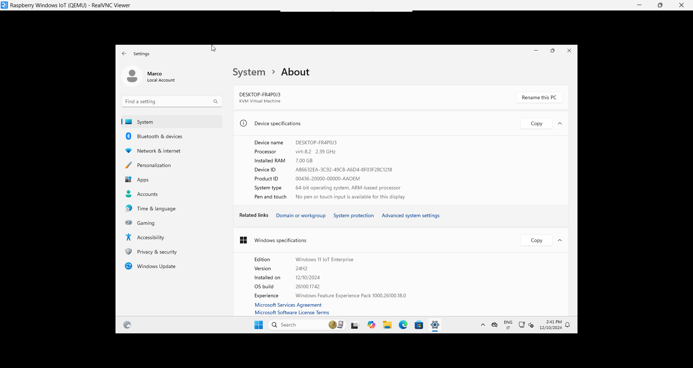

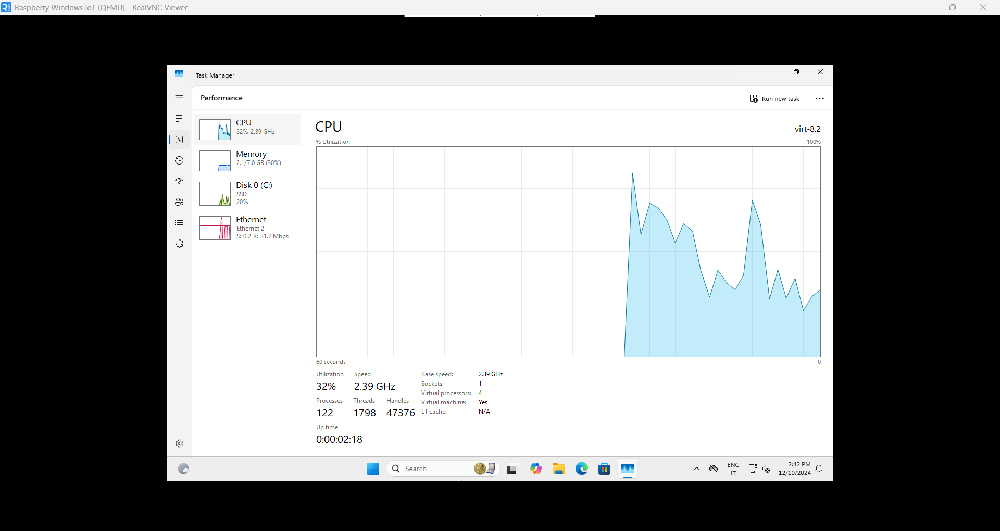